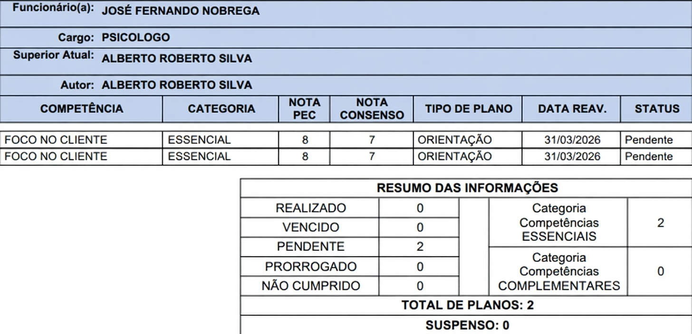
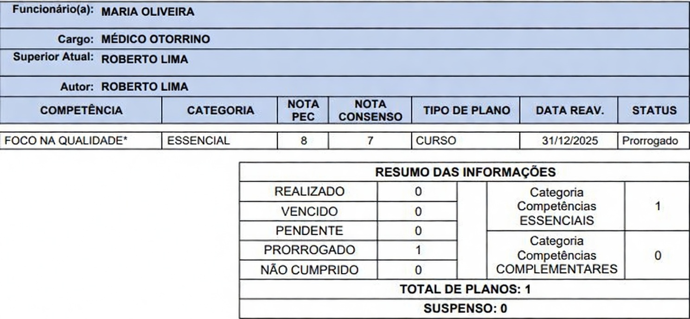
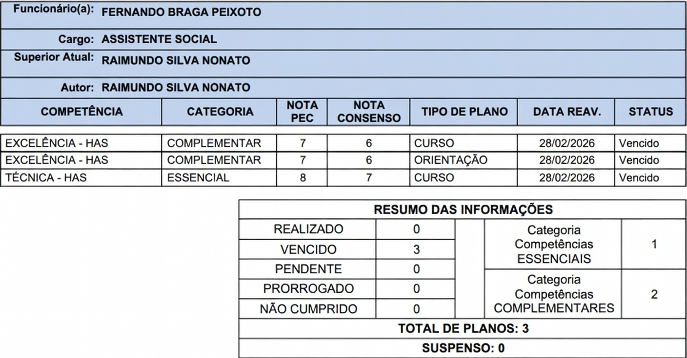
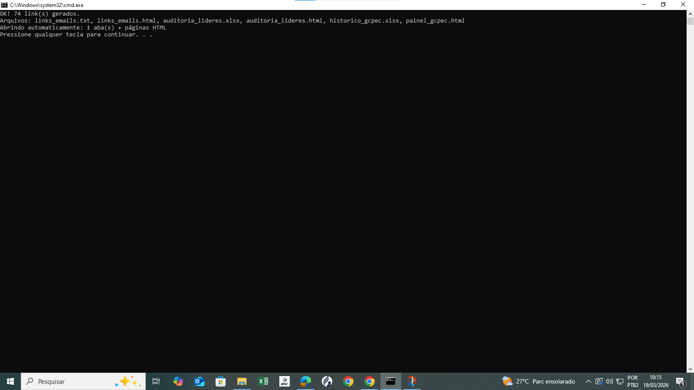
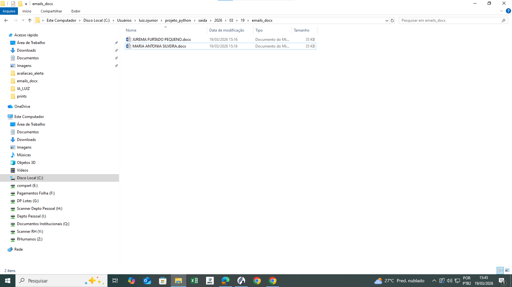
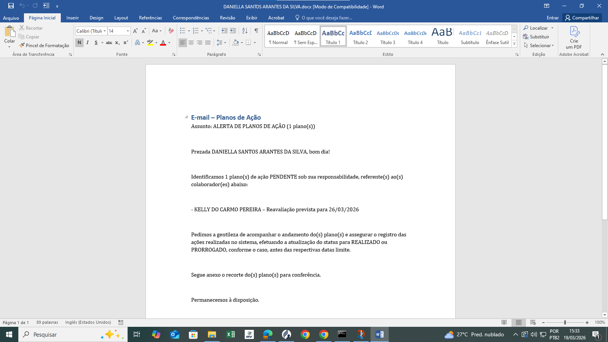

# 📊 Automação de Monitoramento de Planos de Ação

## 🧠 Visão Geral do projeto
Projeto desenvolvido em Python para automatizar a leitura de planos de ação em PDF, identificar líderes, colaboradores e status dos planos, e gerar alertas padronizados para acompanhamento.

A solução reduz retrabalho, melhora a consistência das informações e aumenta a eficiência operacional.

---

## ❗ Problema
O acompanhamento dos planos de ação era realizado manualmente, exigindo:

- Leitura individual de PDFs  
- Identificação manual de líderes e colaboradores  
- Verificação de status (pendente, prorrogado, vencido)  
- Criação manual de mensagens de alerta  

Esse processo era:

- Demorado  
- Repetitivo  
- Sujeito a erros  
- Pouco escalável  

---

## ⚙️ Solução
Foi desenvolvida uma automação em Python que:

- Realiza a leitura automática de arquivos PDF  
- Identifica informações relevantes dos planos de ação  
- Classifica os status trabalhados no processo:
  - PENDENTE  
  - PRORROGADO  
  - VENCIDO  
- Gera mensagens de alerta padronizadas  
- Permite execução simplificada via arquivo `.bat`  

---

## 🚀 Resultados
Com a automação, o processo passou a ser:

- Mais rápido e eficiente  
- Padronizado  
- Menos suscetível a falhas humanas  
- Mais escalável para grandes volumes de dados  

---

## 🖼️ Evidências

### 🔹 Antes
Processo manual com leitura e envio individual de alertas.

📌 Exemplo de plano com status **PENDENTE**:

📌 Exemplo de plano com status **PRORROGADO**:

📌 Exemplo de plano com status **VENCIDO**:

---

### 🔹 Depois
Execução automatizada com geração rápida de alertas padronizados.

📌 Fluxo de execução da automação:

📌 Arquivos gerados automaticamente (DOCX):

📌 Modelo de comunicação gerado:

> 🔄 Evolução prevista: o projeto poderá incorporar futuramente o recorte automático do plano de ação para anexar às comunicações geradas.

---

> ⚠️ Observação: Os dados apresentados nos exemplos são fictícios ou anonimizados para preservar a confidencialidade das informações.

---

## 🛠️ Tecnologias Utilizadas

- Python  
- Manipulação de arquivos PDF  
- Automação de processos  
- Script `.bat` para execução facilitada  

---

## 📁 Estrutura do Projeto

- `entrada/` → Arquivos PDF de planos de ação  
- `saida/` → Arquivos gerados (TXT, DOCX, relatórios)  
- `prints/` → Evidências do funcionamento  
- `main.py` → Script principal  
- `executar.bat` → Execução simplificada  
